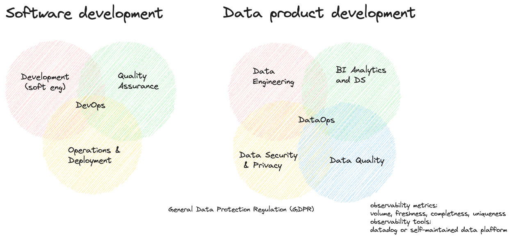
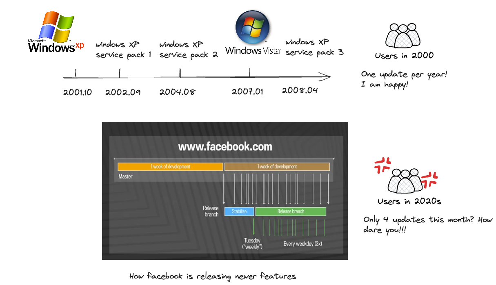
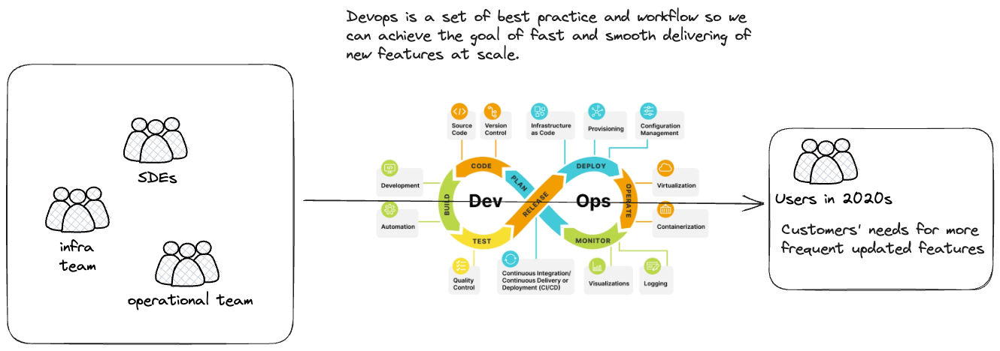
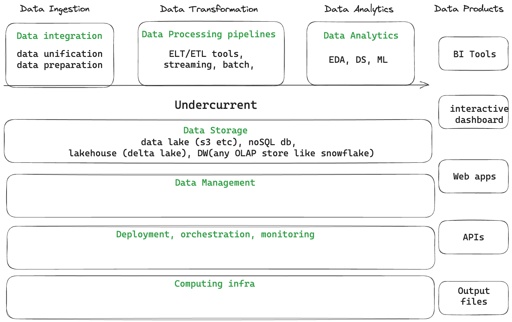

# Data Product and DataOps

- [Data Product and DataOps](#data-product-and-dataops)
  - [Introduction](#introduction)
  - [What's Devops](#whats-devops)
  - [software product vs data product](#software-product-vs-data-product)
  - [Summary](#summary)
  - [Reference](#reference)

## Introduction
Recently, I have came across the term DataOp multiple times. After exploration, i will try to explain the concept of data product and DataOps. This post is more for conceptual understanding and light-read purpose

In the last 10 years, data has been considered as an asset and gradually adopted by more and more companies. With many companies failed attempts of adopting big data in an enterprise settings, industry start to formulate a set of best of practices for delivering data product. This set of best practices is absorbing successful experience coming from its close neighbor software development, as illustrated in the image below, 

DataOps is the set of best practice for "manufacturing" data product, just like manufacturing of a vehicle. Some of questions naturally arise like,
- how to deliver data product fast to adjust to BI/DS teams' needs? 
- how to design the data architecture to be robust enough (data eng), conforms to good security and privacy (compliance and audit purpose) and reliable data quality so stakeholder can trust your data (data quality, observability engineering and reliability engineering)
- etc

To answer those questions and address them, many inspiration have been absorbed from newly risen terms in the last decade and stitched into DataOps  including,
- observability and reliability engineering
- DevOps

In order to better deliver the data product in an enterprise settings, one need to understand DataOps and its close relative DevOps.

## What's Devops

To discuss DataOps, we have to talk about devops first.

Back in 2000s, it is usually takes 1 year or a couple of months to release a new feature. At that time, it has been considered fast and users are happy with it.

Over the past 20 years or so, software company wants to add more features and release them to satisfies user's needs and to implement stakeholder's idea faster. It results in faster software release and user are spoiled so that they have expectations for software to be updated quickly when needed. It in return put greater pressure of releasing faster on the software company. 

Software company consists of teams of difference size and they all collaborate with each other to release software to production. It means that multiple teams need to collaborate together to achieve the same goal that is to deliver software features faster.

> Devops: a set of best practice and workflow for software teams to collaborate and achieve the same goal of fast and smooth software release at scale.

Devops roots from lean manufacturing and agile philosophy. Then it has been honed by many big-tech companies over the last 2 decades by trial and errors to perfect the art of devops and it continue to evolve (at a slower speed now). 

## software product vs data product

The difference between SDE team and DE team is that SDE delivers software while DE delivers data product to be consumed by BI and DS team.

Just like users want to play around with cool new features on instagram, DS and BI team also wants new data as fast as possible. 

For dev-ops of software product, we have the following tools in the pocket:
- ci/cd
- version control
- dev/qa/environment

Why can't we directly copy the best practice from dev-ops to data-ops then? What are exactly holding back the DE's development flow?
- It's hard to duplicate QA environment for ETL since it contains many source integration, infrastructure, cluster and VM configs. Hard to manage all of them in a code format unless some platform has been  
- DE involves too many tech stack and you changes pieces very quickly. It's a lot of work to maintain your CI/CD pipeline for deployment team.

The entropy generated by many tool stacks make it really hard to adopt these best practice. Delivering the data product involves many components as illustrated in the figure below

To addresses these issues, besides ci/cd, version control, more toolings have been developed around the concept of everything-as-a-code including terraform (too sad hashicorp made it business license), Ansible etc.

There is no silver bullet that could solve for this problems since it's dependent case by case among enterprises. It is not a easy task as well but some of the basic design principle sticks, such as
- minimize the number of tech stack you use
- make your data architecture more "micro-servicy" so you could easily switch to new component once that component went stale (let's say every 2 years scan). This will make it more extensible

## Summary

We understand origin and why we need DataOps. This blog mainly serves as an intro for you to dive into the world of delivering good data product in the architecture settings. I personally recommend the book Practical DataOps Delivering Agile Data Science at Scale as a light read if you are want to understand more conceptual part of DataOps, enterprise struggles with big data and how to have a better chance of delivering good data product with a better team composition etc.

## Reference
- [meta engineering: rapid-release-at-massive-scale](https://engineering.fb.com/2017/08/31/web/rapid-release-at-massive-scale/)
- the book: Practical DataOps. This is a good read. more conceptual. 
- Lenny Liebmann called [3-reason why dataops is essential for big data success](https://www.ibm.com/blog/) in IBM big data and analytics hub. He proposed dataops first
- Tamr's CEO Andy Palmer posted in 2016 and now in [2022](https://www.tamr.com/blog/from-devops-to-dataops-by-andy-palmer) on what's DataOps. It made DataOps more buzzwordy back in 2016
