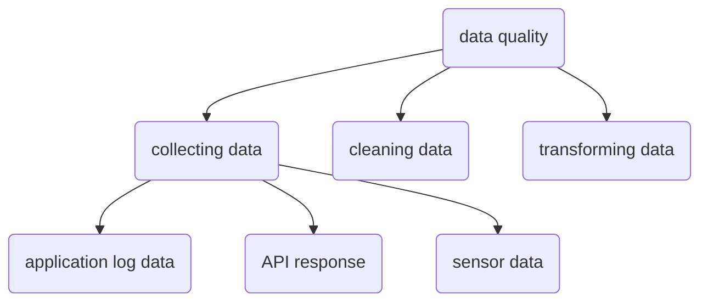

## Chapter 3

```mermaid
flowchart TD
a(data quality)
b(collecting data)
c(cleaning data)
d(transforming data)

a --> b & c & d

b1(application log data)
b2(API response)
b3(sensor data)

b --> b1 & b2 & b3
```
