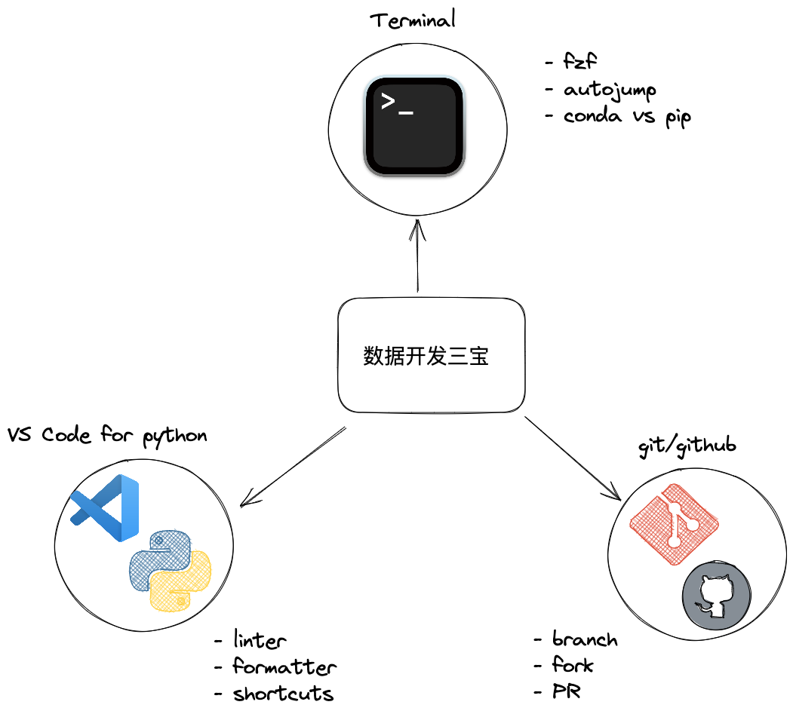

# 加拿大数据人用什么开发环境?
*Table of contents:*
- [加拿大数据人用什么开发环境?](#加拿大数据人用什么开发环境)
  - [terminal终端](#terminal终端)
  - [VSCode + Python](#vscode--python)
    - [Linter](#linter)
    - [VS Code shortcut](#vs-code-shortcut)
  - [Git and github](#git-and-github)
    - [git和github的区别](#git和github的区别)
    - [fork, PR and branch](#fork-pr-and-branch)
- [结语](#结语)

有很多小伙伴提问，数据用什么开发环境？我觉得这个问题很有意思，分几个方面让大家了解一下数据人必备的tech stack.

## terminal终端

学会在terminal中自由遨游是艺术也是基础，这里推荐几个宝藏工具：
- `fzf`: 一个快速模糊搜索工具，可以快速搜索文件，命令，git commit等等
- `autojump`: 你是否厌倦了type in `cd ../../../../`, `autojump`是一个快速跳转工具，可以快速跳转到你常用的目录

对于python的开发环境管理，常见的有`conda` and `pip + venv`
- `conda`: 一个python的环境管理+包管理工具，可以快速创建不同的python环境，比如python3.6, python3.11等等并安装常用的包如`conda install pandas`. 分成`miniconda`和`anaconda`两种distribution, `miniconda`更适合数据人使用，因为它更轻量级，但`anaconda`有用户界面，更适合新手使用. 
- `pip + venv`: pip一个python内置的包管理工具，轻量级, 可以快速安装python的包，比如`pip install pandas`. `venv`是内置的环境管理工具，搭配pip使用，可以快速创建python环境，比如`python3 -m venv .venv`.

它们的区别在于:
- `conda`创建的环境并不在project的目录，可以同时给多个projects使用, 对于某些DS项目更方便. 缺点是conda的包，相对于pypi,更新的慢一些.而且需要额外安装`conda`这个工具，对于容器化时代，这个工具显得有点笨重，但作为开发ML模型和学习python的工具，还是很不错的.
- `venv`创建的环境在project的目录，可以方便的管理，但是每个project都需要创建一个环境，有点麻烦. 但是它的优点是轻量级，不需要额外安装工具，也是必须掌握的.

`conda` and `venv + pip`没有好坏之分，只有适合和不适合，所以大家都要掌握.

## VSCode + Python

### Linter

对于每种编程语言，都有standard style, 用来规范代码的格式，比如python的standard style是`PEP8`. 
比如变量用snake case, 代码的长度不超过80个字符等等.代码的规范，可以让代码更加易读，易于维护，易于debug，在团队协作中，有一个统一的标准，可以减少很多不必要的麻烦.

为了让代码符合standard style, 我们需要一个linter, 用来检查代码是否符合standard style. 一般来说，linter会在你写代码的时候，就给你提示，比如你的代码有多少行超过了80个字符，或者你的代码有多少行没有加上docstring等等. 有了linter, 你就可以专注于写代码，而不是担心代码的格式问题.

推荐几个宝藏工具让你的python代码符合standard style:
- `autopep8`: 自动修复代码格式
- `black`: 自动修复代码格式, 相对于autopep8更加aggresive

### VS Code shortcut

有很多常用的VS Code shortcut, 可以让你的开发效率提高很多，比如:

| Command                               | Description                                                   |
| ------------------------------------- | ------------------------------------------------------------- |
| Command + L                           | Select the current line                                       |
| Command + Shift + L                   | Adding cursor but all selcted file                            |
| Command + P                           | bring up command palette for file search                      |
| Command + Shift + P                   | bring up command palette for command search or add symbol `>` |
| Command + B                           | Toggle on/off sidebar                                         |
| `>zen`                                | a command, hide UI for VS code                                |
| Command + J                           | bring up the terminal                                         |
| Command + /                           | commenting selection based on the language                    |
| Opt + up/down for mac, Alt for window | move a selection of code up and down                          |
| Opt + shift + up/down for mac         | duplicate selection to up and down                            |
| CMD + Opt (mac) CTRL + Alt(win)       | multi line select, use in conjudction with Command + J                                                              |

用windows的小伙伴，可以用`Ctrl`代替`Command`即可，推荐一个宝藏博主，涵盖了很多常用shortcuts
- [VSCODE tech with team](https://www.youtube.com/watch?v=phC-vKlNoaM&ab_channel=TechWithTim)

## Git and github

### git和github的区别

`git`是一个代码版本控制工具，大神linus torvalds开发的，开发的初衷是为了让大型projects的代码管理更便捷，协调所有开发者的代码，让代码的版本控制更加容易. 但`git`并没有提供一个云端的代码托管平台，也没有用户界面都在终端里，所以`github`就诞生了. 

github是基于git的一个代码托管平台，可以让你的代码托管在云端，方便你和其他开发者协作，也可以让你的代码开源，让其他开发者可以看到你的代码. 你可以把它理解为google drive for codes, 竞品产品有gitlab, bitbucket etc.

### fork, PR and branch

`branch`是git的一个重要概念，试想一下我们在写essay时，我有很多版本，试验各种version, 我们有很多不同版本的essay在同一个folder中，久而久之就一团麻. 对代码也是一样的，`branch`
可以让你在同一个project中，同时开发多个feature, 比如你在开发一个网站，你可以同时开发login feature, register feature, profile feature等等，这些feature都是在同一个project中，但是你或者你的队友可以在不同的branch中开发，这样就不会互相影响, 也不会因为要开发几个feature造成project的代码混乱(比如login feature的代码和register feature的代码混在一起). 

`pull request`可以让你在github上，对一个project进行修改，然后你可以把你的修改，提交给原来的project的owner, 让他来决定是否merge你的修改. 相当于提交一个修改的申请. 当你开发完一个feature后，你可以提交pull request (PR), reviewer把这个feature的代码merge到master branch中，这样就完成了一个feature的开发.

`fork`它可以让你在github上，复制一个别人的project到你的github remote repository上，然后你可以对这个project进行修改或开发这个project，然后提交一个PR，merge到原来的project中，这样就可以让你和其他开发者协作了.

# 结语
这些是常用的开发环境，也是加拿大数据人必知必会的，小伙伴们在求职过程中要掌握哦.

