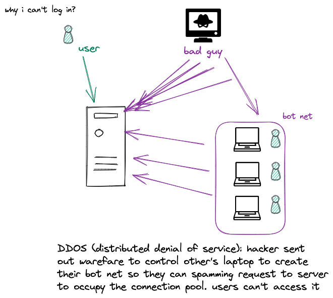

Table of contents:
- [IBM Cybersecurity Series](#ibm-cybersecurity-series)
  - [2 Fundamentals of Confidentiality, integrity and availability](#2-fundamentals-of-confidentiality-integrity-and-availability)
    - [confidentiality](#confidentiality)
    - [Integrity](#integrity)
    - [Availability](#availability)
  - [3 Roles and Tools](#3-roles-and-tools)
  - [4 IAM](#4-iam)
    - [Directory](#directory)
    - [Administration](#administration)
    - [Authentication and Authorization](#authentication-and-authorization)
    - [Audit](#audit)
    - [workforce VS CIAM](#workforce-vs-ciam)
  - [5 Endpoint](#5-endpoint)
- [Reference](#reference)

# IBM Cybersecurity Series

## 2 Fundamentals of Confidentiality, integrity and availability

There are three pillars 
- Confidentiality
- integrity
- availability

This is so called CIA triad.

### confidentiality

Two ways to protect confidentiality, they are
- [x] access control
- [x] encryption

You can use 
- authentication with MFA, so we know it's you 
- authorization to see if the user is allowed to access the resource

Another way is to use encryption, so even if the data is stolen, it's useless without the key.

Such as asymmetric encryption key, public key and private key.

### Integrity

If someone temper your data, you should be able to know and stop them.

### Availability

Bad guy may try to make the service unavailable, such as DDoS attack to make the service unavailable. It's called `denial of service attack` so regular user can't access the service.s

Denial of services:
- DDOS(distributed denial of service) or bot net
- SYN flood

## 3 Roles and Tools

The last two videos talk about some fundamental principal and concepts. This video talks about the,
- role
- mindset
- tools
- domains

看图说话就行了，主要讲security architecture怎么工作的. 一般corporate是这样的
- stakeholder和architecture讨论需求，做high-level设计图 (logical design)
- 然后architecture和engineer一起做low-level设计图 (physical design)

然后就是security architecture的工作

- security expert come in往architecture里添加security control and measure以及security policy
- security expert 顺带分析一下risk，然后给出risk assessment, risk treatment plan, 做这一切的过程中，会按照一个checklist, 比如NIST，一项一项对比

来看一个大体的架构, 如下图，从用户到endpoint, to network, to app, to database这一个大流程

接下来的视频，一个一个深入的讲

## 4 IAM

`IAM (identity and access management) architecture` is shown as image below and it centers around the concept of 4 A's
- administration
- authentication
- authorization 
- audit

### Directory

Directory is a centralized place to (database) store all the information needed for authentication and authorization. Then you can easily manage the access control.

In reality, it's not the case, because many databases are not centralized. Those `siloed database` are called `identity silos`. Due to legacy and regulation reason, it's very hard to centralize them.

Do you have any plan B for non-centralized directory?

We can use the idea of `store` and `sync`. 

- `sync`: synchronize the data from different identity silos to a centralized place, so we can have a centralized view of the data (centralize view not physical table).

既然涉及到了linking distributed soiled identity database, 也就是一个分布式系统问题, 那就会涉及到信息交互，信息交互就需要protocol and standard, 这就是LDAP (lightweight directory access protocol)的由来.

### Administration

Identity administration is the process of creating, maintaining, and deleting user accounts and assigning user rights and permissions to those accounts.

Generally, there are three type of 
- `new employees`: "i want new access, so provisioning access"! 
- `current employees`: "i want more access"!
- `lay-off employees`: "deprovision access"

### Authentication and Authorization

### Audit

### workforce VS CIAM

## 5 Endpoint

# Reference
- [IBM Cybersecurity Architecture Series](https://www.youtube.com/watch?v=jq_LZ1RFPfU&list=PLOspHqNVtKADkWLFt9OcziQF7EatuANSY&ab_channel=IBMTechnology)
- [IBM Technology: what's XDR (extended detection & response)](https://www.youtube.com/watch?v=Nwaigd9H60A&ab_channel=IBMTechnology) 
- [IBM Technology: What's SOAR ](https://www.youtube.com/results?search_query=siem+%2B+soar)
- [IBM Technology: What's SIEM](https://www.youtube.com/watch?v=9RfsRn7m7OE&ab_channel=IBMTechnology)
- [Overview of SIEM: Most Practical Approach](https://www.youtube.com/watch?v=kllStyjewkw&ab_channel=PrabhNair)
- [search qradar security monitoring on youtube](https://www.youtube.com/results?search_query=qradar+security+monitoring)

